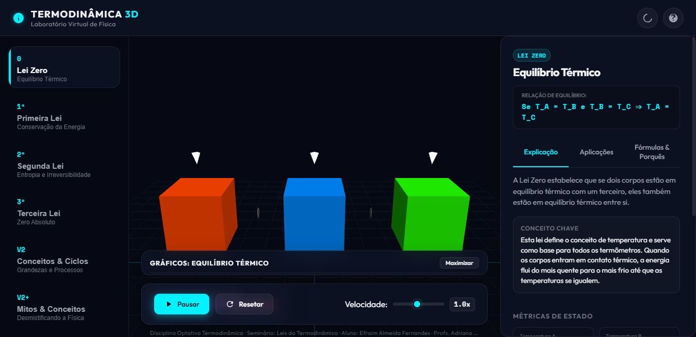
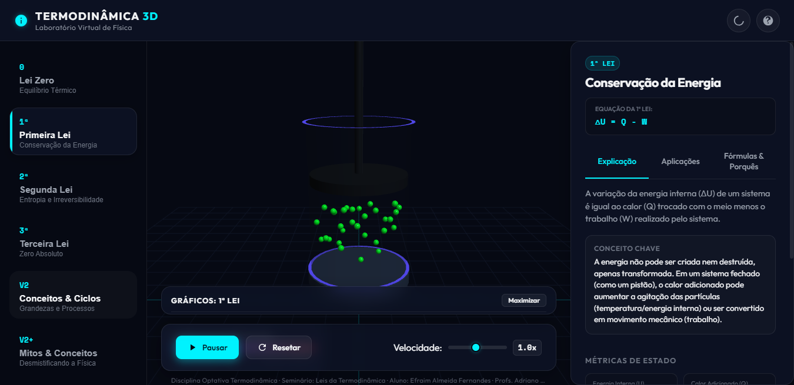
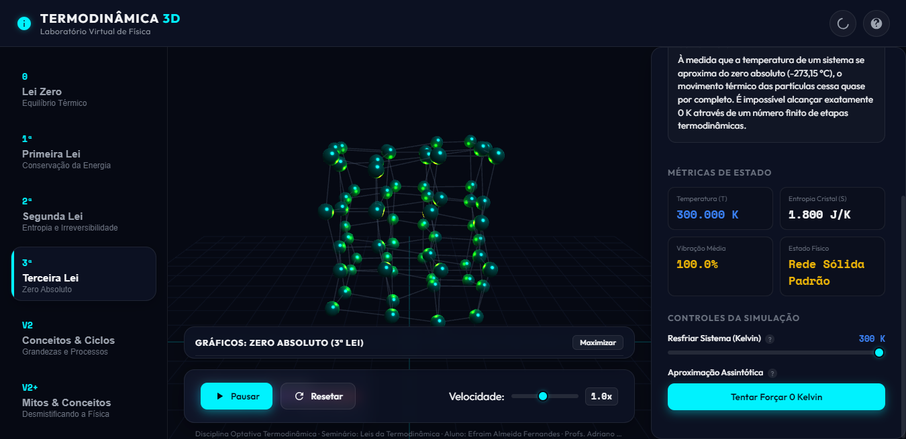
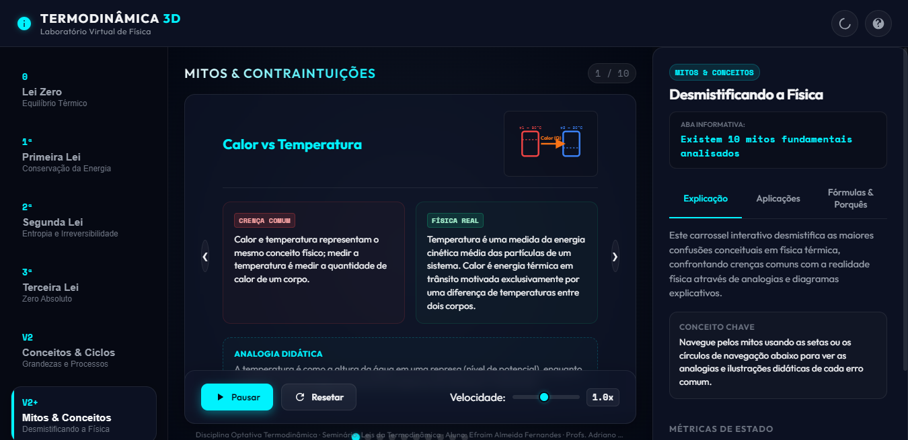
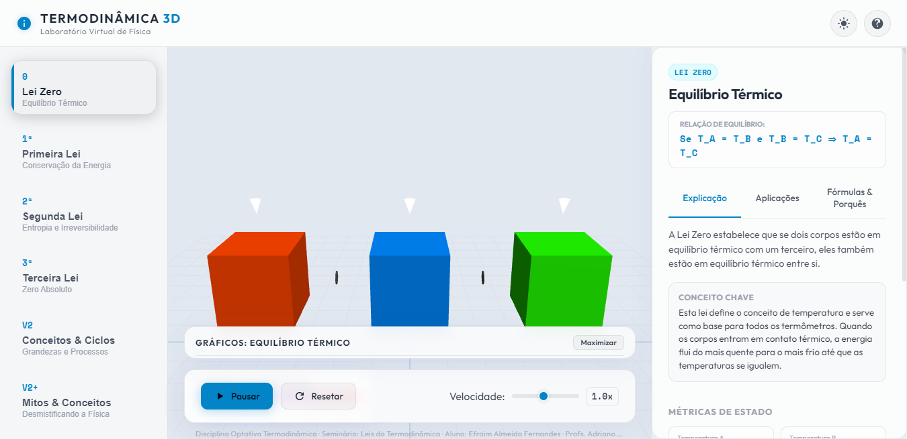

# 🔥 Termodinâmica 3D — Laboratório Virtual de Física

Um **simulador 3D interativo e didático das leis da termodinâmica** para alunos e professores de Física. Explore equilíbrio térmico, conservação de energia, entropia e zero absoluto em um laboratório virtual visual, responsivo e 100% offline.

## 🎓 Autoria e contexto

Este simulador foi desenvolvido como **material de apoio para o seminário de apresentação das leis da termodinâmica**, dentro da **disciplina optativa Termodinâmica**.

| Papel | Nome |
|---|---|
| 🧑‍🎓 Aluno · Desenvolvedor | **Efraim Almeida Fernandes** |
| 👨‍🏫 Professor | **Adriano Ferreira Rozado** |
| 👨‍🏫 Professor | **Marcelo Mendes Vieira** |

<p align="center">
  
  
</p>

## ✨ Recursos

- **6 módulos interativos:** Lei Zero · Primeira Lei · Segunda Lei · Terceira Lei · Conceitos & Ciclos · Mitos & Conceitos
- **Visualização 3D em tempo real** (Three.js): partículas, pistão, transferência de calor, entropia e resfriamento até 0 K
- **Gráficos em tempo real** (temperatura × tempo, energia × tempo) sem nenhuma biblioteca extra
- **Fórmulas interativas** — clique nos termos (ΔU = Q − W, ΔS ≥ 0, H = U + pV…) e veja a explicação de cada símbolo
- **Conteúdo didático por lei:** definição, conceito-chave, exemplo cotidiano, aplicação em ciência/engenharia e "porquês"
- **Painel de métricas ao vivo:** temperatura (K), energia interna, calor, trabalho, entropia, pressão, volume
- **Carrossel de desmistificação** com 10 mitos comuns sobre calor e temperatura
- Tema **claro/escuro**, tutorial inicial, play/pause, reset, velocidade de simulação, layout responsivo (desktop e celular)
- **Funciona sem internet** (dependências embutidas) — ideal para sala de aula

<p align="center">
  
  
</p>

<p align="center">
  
  
</p>

<p align="center">
  
</p>

## 📥 Como usar

### 🚀 Rápido (recomendado) — direto no navegador

Abra **https://efraimafernandes.github.io/termolab-3d/** — funciona em qualquer computador (Windows, macOS, Linux) ou celular, sem instalar nada.

### Opção 1 — Desktop (Windows 10/11)

| Arquivo | Descrição |
|---|---|
| **`Termodinamica3D-1.0.0-x64.exe`** | Instalador (cria atalho no Menu Iniciar e na Área de Trabalho) |
| **`Termodinamica3D-1.0.0-portable.exe`** | Versão portátil — basta executar, sem instalar |

Disponíveis na [página de Releases](https://github.com/EfraimAfernandes/termolab-3d/releases) (ou em `publicacao/dist/` no código-fonte).

> Se o Windows SmartScreen exibir um aviso de "editor desconhecido": clique em **Mais informações → Executar assim mesmo** (o app não é assinado digitalmente).

### Opção 2 — Navegador (qualquer sistema)

Abra a pasta `publicacao/app/` e execute o `index.html`, ou sirva com um servidor simples:

```bash
cd publicacao/app
python -m http.server 8080     # depois acesse http://localhost:8080
```

A versão web também poderá ser publicada gratuitamente em GitHub Pages / Netlify (ver `PLANO.md`).

## 🛠️ Requisitos

- **Desktop:** Windows 10/11 (x64) · **Web:** qualquer navegador moderno com WebGL (Chrome, Edge, Firefox, Safari)
- Funciona offline em ambos os casos (Three.js, OrbitControls e fontes embutidos localmente)

## 📚 Módulos didáticos

| Módulo | Tema | Fórmula central |
|---|---|---|
| Lei Zero | Equilíbrio térmico e temperatura | Se T_A = T_B e T_B = T_C ⇒ T_A = T_C |
| Primeira Lei | Conservação de energia no pistão | ΔU = Q − W |
| Segunda Lei | Entropia e irreversibilidade | ΔS_universo ≥ 0 |
| Terceira Lei | Comportamento próximo de 0 K | S → mínimo quando T → 0 K |
| Conceitos & Ciclos | Grandezas e processos termodinâmicos | H = U + pV |
| Mitos & Conceitos | 10 desmistificações (calor vs temperatura, etc.) | — |

## 🏗️ Como gerar o build do desktop

```bash
cd publicacao/electron
npm install
npm run dist    # gera instalador NSIS + portátil em publicacao/dist/
```

## 🧪 Testado

- ✔️ 6 módulos funcionando (navegador e Electron)
- ✔️ Funciona offline (CDN e fontes removidas do build)
- ✔️ Capturas de tela geradas a partir do próprio app empacotado (`screenshots/`)

## ⚠️ Nota didática

A física é deliberadamente simplificada para fins educacionais (partículas representativas, valores simulados coerentes). Consulte um livro-texto para tratamentos formais. Um **Guia do Professor** com sugestões de aula está planejado (ver `PLANO.md`).

## 📄 Licença

**MIT** — livre para usar, modificar, distribuir e usar em sala de aula. Veja [LICENSE](LICENSE).

Dependências incluídas: Three.js e OrbitControls (MIT), fontes Google Outfit/Space Mono (SIL OFL 1.1).

---

*Material de apoio da disciplina optativa Termodinâmica — feito para ensinar e inspirar. 🎓*
